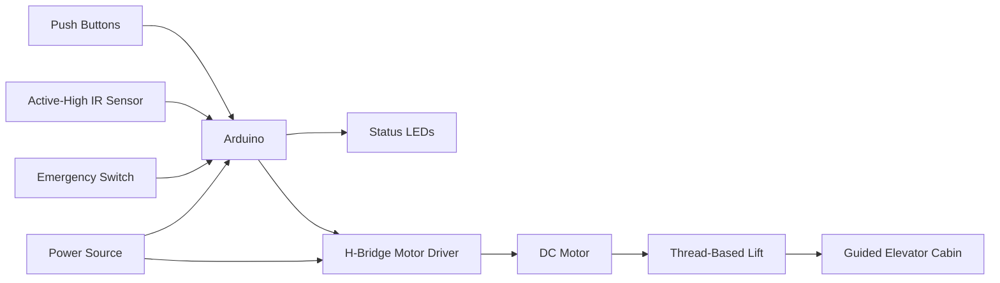

# Arduino Elevator Prototype

A physical miniature elevator prototype controlled by an Arduino, developed in **June 2021** for the **Modern Microprocessor Systems Lab** during my undergraduate studies in **BS Electrical Engineering at the University of Management and Technology (UMT), Lahore, Pakistan**.

The project combined a small embedded control program with a custom-built mechanical structure, a bidirectional motor drive, physical controls, status indicators, an infrared sensor, and an emergency stop switch.

> A demonstration video of the working physical prototype is included in this repository.

---

## Project Scope

This was an undergraduate laboratory prototype—not a production elevator controller, a safety-certified system, or a complex multi-elevator scheduling implementation.

Its value lies in taking a relatively small control problem beyond simulation and making it work as a complete physical system. The project required coordination between:

* Arduino input/output logic
* Bidirectional DC motor control
* Sensor integration
* User controls and visual indicators
* A thread-based lifting mechanism
* A custom frame and guided elevator cabin
* Real-world hardware and mechanical debugging

The result was a functional proof of concept that demonstrated the practical difference between code that works in simulation and a system that must operate with real sensors, wiring, power, friction, alignment, and mechanical load.

## Hardware Used

| Component                 | Role                                                       |
| ------------------------- | ---------------------------------------------------------- |
| Arduino board             | Main controller for reading inputs and controlling outputs |
| DC motor                  | Moved the elevator cabin up and down                       |
| H-bridge / motor driver   | Allowed the Arduino to control the direction of the motor  |
| Active-high IR sensor     | Supplied a detection signal to the control program         |
| Push buttons              | Provided user input                                        |
| LEDs                      | Indicated system or elevator status                        |
| Emergency switch          | Provided a dedicated stop input                            |
| External power source     | Powered the controller and motor circuit                   |
| Thread / string           | Converted motor rotation into vertical cabin movement      |
| Custom elevator frame     | Supported the complete prototype                           |
| Cabin guides and supports | Reduced swinging and kept the cabin aligned                |

## High-Level Operation

The Arduino reads the buttons, IR sensor, and emergency switch.

When a movement command is issued, the controller drives the H-bridge so the motor rotates in the required direction. The motor winds or unwinds the lifting thread, causing the elevator cabin to move vertically.

The LEDs provide visual feedback. The emergency switch is used to interrupt normal operation, while the IR sensor provides a physical input to the controller.

The mechanical supports inside the frame guide the cabin so that it does not simply hang and swing from the lifting thread.



## Active-High Sensor Adjustment

One hardware-specific issue was the logic level produced by the IR sensor.

The sensor used in the prototype was **active high**, so the program had to treat a `HIGH` input as the relevant detection state. This required changing the logic from the behavior initially expected during development.

A simplified representation is:

```cpp
bool detected = digitalRead(IR_SENSOR_PIN) == HIGH;
```

This was a small code change, but an important practical lesson: embedded code must match the actual electrical behavior of the connected hardware.

## Mechanical Build

The physical construction was a meaningful part of the project.

The process included:

* Planning the overall elevator structure
* Visiting carpenters to discuss and manufacture the frame
* Building a custom enclosure for the elevator
* Adding internal supports to guide the cabin
* Assembling and gluing the structural parts
* Mounting the motor and lifting thread
* Adjusting the cabin path and thread tension
* Reworking the assembly when physical behavior differed from the original plan

The cabin supports were particularly important. A cabin suspended only by thread could rotate, swing, or become misaligned, so the frame had to constrain its movement.

## Main Challenges

### Moving from simulation to hardware

The main difficulty was not the size of the program itself, but making the software, electronics, and mechanical assembly behave as one system.

Real hardware introduced issues that were either absent or simplified in simulation, including:

* Sensor polarity
* Wiring mistakes and loose connections
* Motor direction
* Power delivery
* Mechanical friction
* Thread tension
* Cabin alignment
* Motor inertia and stopping behavior

### Motor control

The Arduino could not drive the motor directly. An H-bridge motor driver was needed to handle the motor current and reverse its direction for upward and downward movement.

### Cabin stability

The thread provided lifting force but not stability. The custom guides and supports were required to keep the cabin moving along a usable path.

### Iterative debugging

Problems were not isolated to one area. A software change could reveal a wiring problem, while a mechanical adjustment could change how the motor and sensor behaved. The prototype therefore required repeated testing and adjustment.

## What I Learned

This project provided practical experience with:

* Microcontroller-based input and output
* Interfacing buttons, LEDs, and sensors
* Active-high and active-low digital logic
* Bidirectional DC motor control
* Using an H-bridge motor driver
* Emergency input handling
* Power and grounding considerations
* Mechanical prototyping
* Hardware/software integration
* Debugging a physical embedded system
* Translating a simulated idea into a working prototype

## Running the Project

The exact wiring should be matched with the pin definitions in the Arduino source code included in this repository.

A typical setup process is:

1. Open the Arduino sketch in the Arduino IDE.
2. Review the defined input and output pins.
3. Connect the buttons, LEDs, IR sensor, emergency switch, and motor driver accordingly.
4. Ensure the Arduino and motor driver use the required common ground.
5. Connect the motor through the H-bridge rather than directly to the Arduino.
6. Select the correct Arduino board and serial port.
7. Compile and upload the program.
8. Test each input and output separately before attaching the lifting mechanism.
9. Operate the complete prototype only after checking the thread, cabin guides, and emergency switch.

> Motor voltage and current requirements must be checked against the motor driver and power source being used.

## Demonstration

A video showing the completed physical elevator prototype in operation is included in the repository.

The video is useful because it documents that the project was implemented on actual hardware rather than only as a circuit simulation or code exercise.

## Limitations

This project was created for an undergraduate laboratory course and should be understood within that scope.

It does not claim to include:

* Certified elevator safety mechanisms
* Redundant sensors or braking systems
* Passenger-safe mechanical construction
* Advanced request scheduling
* Precise closed-loop position control
* Industrial reliability or fault tolerance
* Compliance with elevator or building regulations

The emergency switch in this prototype was an educational control feature and must not be treated as equivalent to a certified emergency system.

## Possible Extensions

Potential improvements to the prototype include:

* Dedicated position or floor sensors
* Upper and lower limit switches
* Button debouncing
* A finite-state-machine-based controller
* Motor timeout and fault handling
* An encoder for more accurate position feedback
* A floor display
* Improved rails, pulleys, or bearings
* A documented schematic and pin-assignment table

## Retrospective Note

This project was completed around **June 2021**, while I was still enrolled as a bachelor’s student at UMT.

This README was written later to properly document the work and preserve the context in which it was created. The project is presented as it was: a modest but complete undergraduate embedded-systems prototype that required software development, electronic integration, mechanical fabrication, and hands-on debugging.

## Safety Notice

This repository documents a student prototype. It must not be used to control a real passenger or goods elevator.

Real elevator systems require professionally engineered structures, certified control hardware, redundant sensing, braking systems, formal safety analysis, and compliance with applicable regulations.

## Academic Context

* **Institution:** University of Management and Technology, Lahore, Pakistan
* **Program:** BS Electrical Engineering
* **Course:** Modern Microprocessor Systems Lab
* **Approximate completion date:** June 2021
  ::: 
